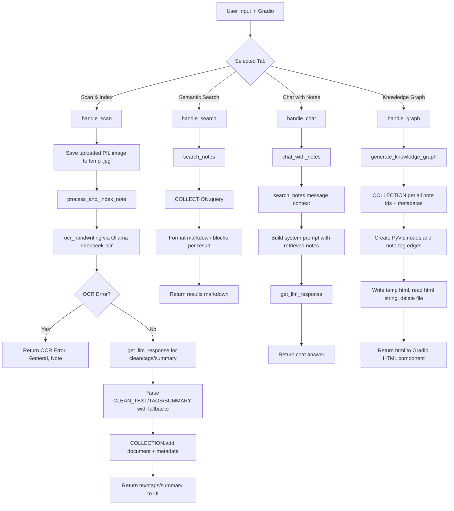

# Digital Second Brain

## 1. Project Overview

Digital Second Brain is a local-first handwritten-notes workflow with a Gradio interface.

From the implemented code, the system does the following:
- Accepts an uploaded or webcam image of notes.
- Runs OCR through Ollama (`deepseek-ocr`) to transcribe text.
- Optionally refines OCR output with an LLM (provider/model selected in the UI).
- Stores note text + metadata in a persistent ChromaDB collection.
- Supports semantic retrieval from stored notes.
- Supports chat answers grounded in retrieved notes.
- Generates an interactive HTML knowledge graph from note metadata.

Problem addressed by the implementation: converting handwritten note images into searchable and queryable personal knowledge entries.

---

## 2. Architecture Overview

### High-level design

The repository has two runtime modules:
- `app.py`: Gradio UI and event wiring.
- `backend.py`: OCR, provider integration, indexing, retrieval, chat orchestration, graph generation.

### Components

| Component | File | Responsibility |
|---|---|---|
| UI layer | `app.py` | Renders tabs, captures user inputs, delegates to backend handlers |
| Backend logic | `backend.py` | Executes OCR, LLM calls, vector storage/retrieval, graph HTML generation |
| Storage | `backend.py` | `chromadb.PersistentClient(path="./chroma_db")`, collection `notes_db` |
| Embeddings | `backend.py` | Tries Ollama `embeddinggemma`; falls back to Chroma default embedding function |

No separate workflow engine or agent framework is implemented.

---

## 3. System Flow

### End-to-end execution flow

1. User interacts with one of four UI tabs (`Scan & Index`, `Semantic Search`, `Chat with Notes`, `Knowledge Graph`).
2. UI handler in `app.py` calls the corresponding backend function.
3. Backend reads/writes ChromaDB and/or calls OCR/LLM providers.
4. Backend returns plain text or HTML to the UI.
5. Gradio displays outputs in text/markdown/chat/html components.

### Mermaid flow (implementation-accurate)



---

## 4. Workflow / Agent Logic

No explicit agent graph, node executor, or retry controller exists.

Implemented workflow logic is function-based with conditional branches:
- `process_and_index_note` short-circuits when OCR returns an error string prefixed with `OCR Error:`.
- LLM post-processing uses string-format parsing and fallback behavior when expected markers are missing.
- `get_llm_response`, `search_notes`, and `generate_knowledge_graph` catch exceptions and return error text/HTML.

State transitions are request-scoped (per function call) plus persistent note storage in ChromaDB.

---

## 5. Data Model / State Structure

### Persistent note record (ChromaDB)

Stored by `COLLECTION.add(...)` in `process_and_index_note`:

| Field | Type (as stored) | Source |
|---|---|---|
| `id` | `str` (UUID4) | generated in backend |
| `document` | `str` | cleaned text (or fallback raw/processed text) |
| `metadata.date` | `str` (`YYYY-MM-DD HH:MM`) | current local datetime |
| `metadata.tags` | `str` | parsed LLM tags or default `General` |
| `metadata.summary` | `str` | parsed LLM summary or default `Note` |
| `metadata.source` | `str` | image file path passed to processing function |

### Runtime data shapes

| Function | Input state | Output state |
|---|---|---|
| `handle_scan` | `image`, `provider`, `model`, `key` | tuple `(text, tags, summary)` |
| `search_notes` | `query`, `n_results` | markdown `str` or `Search Error: ...` |
| `chat_with_notes` | `message`, `history`, provider/model/key | LLM response `str` |
| `generate_knowledge_graph` | none | HTML `str` |

Note: `history` is accepted in chat flow and passed through UI/backend signatures, but not used in backend logic.

---

## 6. Core Modules Breakdown

### `backend.py`

| Function | Purpose | Input | Output | Behavior |
|---|---|---|---|---|
| `get_llm_response` | Unified LLM provider wrapper | prompt, system prompt, provider, model, api key | `str` | Routes to Local (Ollama), OpenAI, Anthropic, Gemini; returns unsupported-provider/error text on failure paths |
| `ocr_handwriting` | OCR transcription from image | `image_path` | `str` | Calls Ollama `deepseek-ocr` with image; returns `OCR Error: ...` on exception |
| `process_and_index_note` | OCR → optional cleanup/tagging → indexing | image path + provider/model/key | tuple `(clean_text, tags, summary)` | Handles OCR failure short-circuit; parses structured LLM output with defaults; adds document + metadata to Chroma |
| `search_notes` | Semantic retrieval + formatting | query, `n_results` (default 3) | `str` | Calls Chroma query and formats markdown for each result; returns not-found or error text |
| `chat_with_notes` | Retrieval-augmented chat response | message, history, provider/model/key | `str` | Uses `search_notes` output as context in a system prompt, then calls `get_llm_response` |
| `generate_knowledge_graph` | Build interactive graph HTML | none | HTML `str` | Reads all notes, creates note/tag nodes and edges in PyVis, writes temp HTML, returns HTML, deletes temp file |

### `app.py`

| Function | Purpose | Input | Output |
|---|---|---|---|
| `handle_scan` | Bridge scan tab to backend | image + provider/model/key | tuple `(text, tags, summary)` |
| `handle_search` | Bridge search tab | query | search markdown/error string |
| `handle_chat` | Bridge chat tab | message, history, provider/model/key | chat response string |
| `handle_graph` | Bridge graph tab | none | graph HTML string |

---

## 7. Security Model

Implemented protections are limited and explicit:

- Provider calls are wrapped in exception handling and return error strings instead of raising.
- OCR failure in `process_and_index_note` is explicitly prevented from being indexed.
- Graph generation uses temporary files and removes them after HTML is read.
- No SQL execution path exists in this repository.

Not implemented in code:
- No authentication or authorization layer.
- No rate limiting.
- No content moderation/sanitization pipeline.
- No encryption management code in application layer.

Security guarantees should be interpreted as minimal, based on current implementation only.

---

## 8. LLM / Provider Integration

### Supported providers (implemented)

- `Local (Ollama)` via `ollama.chat`
- `OpenAI` via `OpenAI(...).chat.completions.create(...)`
- `Anthropic` via `anthropic.Anthropic(...).messages.create(...)`
- `Gemini` via `google.genai` model generation

### Model selection

In the UI sidebar (`app.py`):
- Provider dropdown options: `Local (Ollama)`, `OpenAI`, `Anthropic`, `Gemini`
- Model dropdown default/options include `glm-4.7-flash`, `lfm2.5-thinking`, `llama3`, `gpt-4o`, `claude-3-5-sonnet`
- `allow_custom_value=True` allows custom model names.

### Fallback logic present in code

- Embeddings: tries Ollama `embeddinggemma`; on exception falls back to Chroma `DefaultEmbeddingFunction`.
- LLM wrapper: returns explicit error text for unsupported provider or runtime exceptions.
- Parsing fallback in note processing: if output format markers are missing, uses safe defaults.

---

## 9. Setup & Installation

### Prerequisites

- Python installed.
- Dependencies from `requirements.txt`.
- For Local provider/OCR paths: an available Ollama runtime.

### Install (Windows PowerShell)

```powershell
python -m venv .env
.\.env\Scripts\Activate.ps1
python -m pip install --upgrade pip
pip install -r requirements.txt
```

---

## 10. Running the Application

From repository root (Windows PowerShell):

```powershell
.\.env\Scripts\python.exe app.py
```

What is presented by the UI:
- Sidebar settings for provider, model, API key.
- Four tabs:
  - `📸 Scan & Index`
  - `🔍 Semantic Search`
  - `💬 Chat with Notes`
  - `🕸️ Knowledge Graph`

Expected behavior is exactly the tab-specific flow described in Section 3.

---

## 11. Testing

### Framework and layout

- Test framework: `pytest`
- Test files:
  - `tests/test_app_handlers.py`
  - `tests/test_backend_unit.py`
  - `tests/test_backend_integration.py`
  - `tests/conftest.py` (test doubles and fixtures)

### Run tests

```powershell
.\.env\Scripts\python.exe -m pytest -q -s
```

Repository-visible test report (`TEST_REPORT.md`) records: `27 passed` for the current suite.

---

## 12. Limitations

Grounded in current implementation:

- OCR model in code is fixed to `deepseek-ocr` in `ocr_handwriting`.
- Chat retrieval context is built from formatted markdown text (`search_notes` output), not structured retrieval objects.
- `history` parameter in `chat_with_notes` is currently unused.
- Graph generation scans the full collection on each refresh (`COLLECTION.get()`), then rebuilds graph HTML.
- Error handling is broad (`except Exception`) in multiple paths and converts errors into strings/HTML.
- Local persistence is tied to `./chroma_db` path.

---

## 13. Future Improvements (Code-Implied)

The following are directly suggested by observed implementation constraints (not speculative feature claims):

- Introduce structured retrieval objects for chat context instead of markdown-formatted intermediate text.
- Use conversation history in backend chat orchestration or remove unused parameter to simplify API contract.
- Add more granular exception types and error channels beyond generic string messages.
- Add pagination or scope controls for graph generation when note volume grows.

---

## Repository Structure

```text
app.py
backend.py
requirements.txt
tests/
  conftest.py
  test_app_handlers.py
  test_backend_unit.py
  test_backend_integration.py
```
